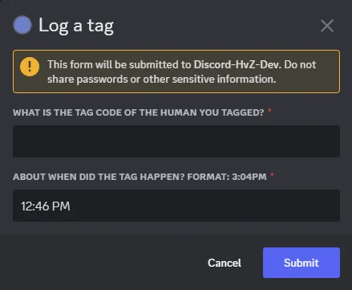

# Customized Chatbots

!!! info "Prerequisite"
    **This page assumes you've read the [Running the Game](running_the_game.md) page after [setting up your bot](server_setup.md).**

## Beginning

**Chatbots** follow **scripts** which are a series of **questions** with information on what to do with the answers. Scripts also have accompanying information on what to do with the entire set of answers, and what to say to the target member. Think of a script like the piece of paper a survey-taker would use.

Every script requires a **table** in the bot's database, where every row is one completed chatbot. Every question needs a column on the table to store the answer.

The two big, default, *required* chatbots are `registration` and `tag_logging`. Your HvZ game is unique, and requires questions phrased for your situation. By default, the registration script comes with a question for the member's CPO number (that's the school post-box address). Well, your game may not need that. This page will teach you how to remove that question, add new ones, and customize other things in these chatbot scripts.

Scripts are stored in the `scripts.yml` file, written in the YAML configuration language. It is recommended to use a code editor such as [Notepad++](https://notepad-plus-plus.org/downloads/) or one one of many other options.

## Modal Chatbots

There are two types of chatbots: **modal** and **non-modal**. A modal chatbot shows the user a pop-up window that contains all the questions of the script. By default, the `tag_logging` chatbot is modal. Modal chatbots are faster to use—especially on mobile—but have tighter restrictions than non-modal.

**Modal Example:**




!!! info "Modal Restrictions"
    All valid modal chatbots are also valid non-modal chatbots, except for the `modal: true` field.

    - No more than 5 questions
    - No more than 45 characters in a question query
    - No [button_options](#button_options) to select answers

??? example "Example Modal Script"
    ```yaml
    tag_logging:
      table: tags
      modal: true
      beginning: Let's log a tag. Type 'cancel' at any time to stop this conversation.
      ending: Tag logged! Make sure your newly-brainless friend feels welcome in the hoard.
      starting_processor: tag_logging_start
      ending_processor: tag_logging_end
      questions:
      - column: tagged_id
        display_name: Tag Code
        query: What is the tag code of the human you tagged?
        valid_regex: '[a-zA-Z\d]{6}'
        rejection_response: 'Invalid tag code. The tag code is 6 characters of numbers and capital
          letters. None of these: 0 O Q I 1 D V U 5 S 2 Z'
        processor: tag_code_to_member_id
      - column: tag_time
        display_name: Tag Time
        query: "About when did the tag happen? Format: 3:04pm"
        valid_regex: '(?i)\d{1,2}:[0-5]?[0-9]\s?(am|pm)\s?(yesterday)?'
        rejection_response: Please use a format like 12:26pm or 7:00 am
        modal_default: current_time
        processor: tag_time
    ```


**Coming Up**

- Edit script fields
- Add or remove questions
- Add chatbots

## Script Fields

Changing text your users see in a chatbot is the easiest thing. Find a phrase in the script and edit it. Surround your text in single quotes if you need to use any of the following special characters: `:-{}[]!#|>&%@`, or if your text is only "yes", "no", "true", "false", or something similar.

See a `|-` in the file? That means what comes next is a multi-line piece of text that the bot should see as literally multiple lines.

If you are unsure about using unusual text, read [this reference.](https://docs.octoprint.org/en/master/configuration/yaml.html)

Below is an example of a functional tag_logging script similar to the one the bot comes with by default. You can use this as reference as you read onward.

Any field marked as **Optional** can be omitted entirely and the bot will use some default instead.  
The order of the fields does not matter, except that questions are displayed in the order they appear.
??? example "Example tag_logging Script"
    ```yaml
    tag_logging:
      table: tags
      beginning: Let's log a tag. Type 'cancel' at any time to stop this conversation.
      ending: Tag logged! Make sure your newly-brainless friend feels welcome in the hoard.
      questions:
      - column: tagged_id
        display_name: Tag Code
        query: What is the tag code of the human you tagged?
        valid_regex: '[a-zA-Z\d]{6}'
        rejection_response: 'The tag code is 6 characters of numbers and capital
          letters. None of these: 0 O Q I 1 D V U 5 S 2 Z'
        processor: tag_code_to_member_id
      - column: tag_time
        display_name: Tag Time
        query: About what time did the tag happen? Use the format 3:04pm. If it was yesterday, add "yesterday" to the end.
        valid_regex: '(?i)\d{1,2}:[0-5]?[0-9]\s?(am|pm)\s?(yesterday)?'
        rejection_response: Please use a format like 12:26pm or 7:00 am
        processor: tag_time
    ```


??? info "Concise Field Reference."
    ``` yaml
    script_name: # Name of the script. Only for organization. Required, unique.
      table: members # Required, unique
      beginning: Registration started! # Message that appears when the chatbot starts. Optional.
      ending: Welcome to HvZ! # Message that appears when the chatbot ends. Optional.
      postable_button_color: green # Chatbot button color: green, red, blurple, gray, or url. Optional.
      postable_button_label: Click Me! # Visible label on the chatbot button. Optional.
      questions: # A list of the questions. Required.
      - column: favorite_color # The database column the answer will go in. No spaces, lower case. Required, unique per script.
        column_type: string # The data type of the column in the database. string, boolean, integer, datetime, or incrementing_integer
        display_name: Favorite Color # The name of the question the user will see. Required.
        query: Favorite color? # The question text. Required.
        valid_regex: '\D*' # The regex the answer must satisfy. Optional.
        button_options: # A list of buttons with pre-selected responses with button colors. Optional, all must pass regex.
          'Green': green # The right value (green) can be blurple, gray, green, red, or url
          'Periwinkle': red # 'Periwinkle' is the literal text response. 
        rejection_response: No numbers allowed in colors. # Response if the answer fails the regex test. Required if there is "valid_regex"
        processor: favorite_color # Described later in this document. Optional
    ```


### `<script title>`
Required, unique

In the example above, the word `tag_logging` at the top declares that everything indented beneath it is the tag_logging script. If this name changes, any existing buttons for this chatbot will break. This should be lowercase and without spaces.

!!! warning
    Currently, you *must* have a script titled "tag_logging" and one titled "registration" for the  
    [/tag create](commands.md#tag-create) & [/member register](commands.md#member-register) commands to function.

### `table`
Required, unique.  
Which table the script will be saved to. Tables are created automatically as needed; the old `database_tables` config option is ignored in 0.4.0+.

### `modal`
Optional, either `true` or `false`  
Is this a modal chatbot? [See above](#modal-chatbots) for restrictions. If this field is missing, it is `false`.

### `modal_title`
Optional, modal only, default: value of `<script title>`  
The heading shown at the top of a modal. Max 45 characters.

### `beginning`
Optional, non-modal only  
default: `"Starting chatbot. Reply with 'cancel' at any time to stop.`  
A message sent when the chatbot starts. It should inform the user that they can type "cancel" to stop the chatbot as well.

### `ending`
Optional, default: `"Chatbot complete!"`  
A message sent when the chatbot ends. Preferably, it should tell the player what they ought to do next.

### `starting_processor`
Optional, Advanced Option  
The name of the starting processor function the script should use. This feature is not yet documented.

### `ending_processor`
Optional, Advanced Option  
The name of the ending processor function the script should use. This feature is not yet documented.


### `postable_button_color`
Optional, default: `green`  
The color of the button used to start the chatbot. Valid values: **blurple, gray, green, red, url**. These colors are limited by Discord. Green by default.

### `postable_button_label`
Optional, default: same as `<script title>`  
The text that appears on the button used to start the chatbot.

### `questions`
Minimum 1 question  
Questions are indented beneath this heading, marked with a `-` as shown in the example. They are asked in the order listed here.

## Question Fields

### `column`
Required, unique per script  
The database column the question is saves to. When the bot is working with the question, this is effectively its "name". Remember, database column names should be lower case and without spaces. A name like "most_favorite_color" is fine.

### `column_type`
Optional, defaults to 'string'  
The data type of the column in the database. Does not need to be specified for essential columns that the bot requires to function. If making a custom question, the default 'string' value will suffice.  
When exported to Google Sheets, equivalent types will be chosen. If you choose a type other than string, your question must use regex or a processor to ensure the input actually matches.

Valid types: string, integer, boolean, datetime, incrementing_integer (Aliases: str, int, bool, incr_integer)

An incrementing_integer is an integer column that is not set by the bot. Each time a new row is added to the database, a guaranteed unique integer one higher than the last is added to this column.
*There can only be one incrementing_integer per table.*

### `display_name`
Optional, non-modal only, default: value of `column`  
The human-friendly name users are showed when reviewing their responses.

### `query`
Required  
The text of the question. Make sure it is concise, but unambiguous for best human results. Max 45 characters if modal.

### `valid_regex`
Optional  
Regex means "regular_expression", which is a special language for pattern matching. For example, `(?i)(yes|no)` is a set of coded symbols that tells the program it needs to match either "yes" or "no", ignoring case.

If `valid_regex` is provided, the bot will check the question's answer against the regex string, and if it matches *completely*, the answer is accepted. Note that any leading or trailing whitespace is stripped away from answers before this.

There are many resources online for building regex, including this one: [regex101.com](https://regex101.com/)

### `rejection_response`
Required if `valid_regex` is supplied.  
The response the user is sent if their answer fails the regex test. They are given the opportunity to submit another response until they send a valid one.

### `button_options`
*Optional, non-modal only*  
A list of buttons that will appear with the question, letting a user tap the buttons instead of typing a response. Each button is a response:color pair, where the response is the value the bot will receive, and the color is one of these: **blurple, gray, green, red, url**.   
The response text is *exactly* what the bot will receive and is handled the same as typed text. Thus, the values **must** all pass any `valid_regex` set.  
Follow the format in the below example precisely.

??? example "Example button_options"
    ```yaml
    button_options:
      'Yes': green
      'No': red
      'Maybe': blurple
    ```

### `modal_default`
*Optional, modal only, default: `None`*  
The default value the response field is filled with when the modal is first launched. Can be text, a number, or a `true` / `false` value.  
If this is set to `'current_time'`, the field will contain the current time minus one minute.

### `modal_long`
*Optional, modal only, default: `false`*  
If `true`, the response field is multi-line, suitable for long-form responses, and has a character count. If `false`, the field is single-line and best for short responses.  
In either case, the character limit is 4000.

### `processor`
*Optional*  
A processor is a function that takes the response given by the user, then validates and/or transforms it. Customizing these is an advanced feature not yet documented. Ask the developer for help with customization.  

!!! info "Available question processors"
    `tag_time` converts the input text into a datetime object which specifies an exact timezone-aware date and time. If 'yesterday' is in the text, the previous day is used. Future times raise an error.
    The question that uses this should also use a regex. It has been tested with this one:  
    (?i)\d{1,2}:[0-5]?[0-9]\s?(am|pm)\s?(yesterday)?  
    `tag_code_to_member_id` converts the input text into the Discord ID of the tagged member if the text matches a tag code. Raises an error if it does not match, the member is not on the server, or they are already a zombie.

## Add or Remove Questions

To add a question, these are the basic steps:

- Add a new question section to a script in `scripts.yml` via copy-paste
- Edit the values to your liking, making sure to pick a new column name
- Consider if you need to specify a [`column_type`](#column_type) other than a string. In most cases, you do not, and can ignore this.
- Delete your existing database file and restart the bot, which will re-create it with your new column.
- Test the chatbot!

When using copy-paste to add a new question, make sure the indentation lines up. Indentation is made with spaces, not tabs.


!!! warning
    The bot will *not* add new columns to an existing table in the database. This is called "migration" is and something the bot does not support for safety reasons. If you delete your database, the bot will create a fresh one that includes your new columns. If you need to add new columns without deleting your database, use a database editor such as [DB Browser for SQLite](https://sqlitebrowser.org/).

You ought to thouroughly test the new question to make sure it looks the way you want, especially if you are using regex or processor functions.

To remove a question, these are the basic steps:

- Delete the question section in its script in `scripts.yml`

## Custom Processors

A processor is a function that accepts either a question response or the set of responses from the entire chatbot and validates them, perhaps even transforming the result. They are core to how the bot works and are designed to be personalized. When a member is registered, a processor is the function that adds additional columns to the database such as Discord name and nickname. Making a publically useable API is difficult, however, so customizing these processors is not ready for public release and has no documentation.

If you would like to customize how question or chatbot data is processed, please contact the developer at conneranderson.dev@gmail.com. He's happy to consider your request and if feasible, work with you to customize your version of the bot.

!!! warning "Under Construction"
    Custom processors are a complex feature that could lead to many pitfalls. The documentation still needs to be written. For now, if you want custom functionality, contact the author of Discord-HvZ.

