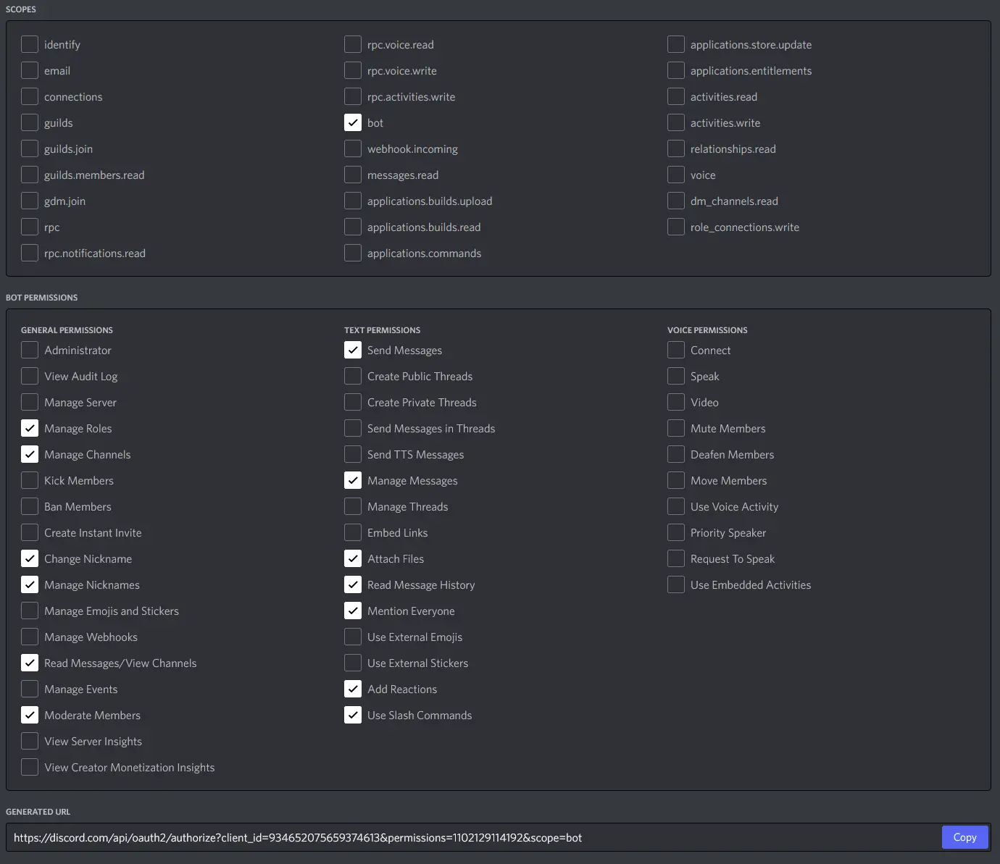
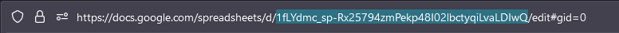

# Installation :material-download:

Discord-HvZ is a Python application that *you* run yourself on nearly whatever computer you like. There are both Windows and Linux versions available, with a Mac version coming soon.  
You must complete all the steps on this page for the bot to launch without errors.

!!! info
	While setting up and managing your bot, you will have to edit configuration files. It will be more pleasant to edit these with a text editor that understands code, such as [Notepad++](https://notepad-plus-plus.org/downloads/).


## Software Installation

There are two ways to install the software itself:

!!! tip "Express Install"

	**Download a simple executable that runs from a folder.**

	This is an easy method for those who don't care about viewing or editing the source code. The caveat is that you can't use [custom script processors](customized_chatbots.md#custom-processors), which is an advanced feature that doesn't have documentation yet.


!!! warning "Advanced Install"

	**Install the Python package with all dependencies.**

	This allows one to edit any of the source code, and use [custom script processors](customized_chatbots.md#custom-processors). For those who intend to tinker with things under the hood, or even contribute to the project.

	uv handles the Python environment and dependencies for you. You will still need to finish the Discord and Google setup below.


??? info "Swapping Between Install Methods"
	If you've been using the program with one install method and want to swap,
	simply move the critical files between them. **You can't transfer custom script processors to an Express Install.**  
	These are the files you should transfer, if they exist:

	- .env
	- config.yml
	- credentials.json
	- The database file named by [database_path](config_options.md#database_path) in config.yml
	- scripts.yml
	- token.json


### Express Install


=== ":simple-windows: Windows"

	1. Download the latest "Express Install" .zip for Windows from [Releases](https://github.com/Conner-Anderson/discord-hvz/releases){target=_blank}
	1. Unzip it to a convenient folder you intend to run the bot from.
	1. Run **Discord-HvZ.exe**. The app should open, then close with an error because there are still setup steps to complete. Start with [Creating a Discord Bot](#creating-a-discord-bot)

	??? tip "Alternate Start Method"
		If you'd like the terminal window to **stay open** between runs of the bot so you can read errors easier, you'll have to start it from a terminal.  
		In File Explorer, go inside the install folder, click once in the address bar, type `cmd` or `powershell`, then hit Enter.  
		Now type `.\Discord-HvZ.exe` and hit Enter. The bot will start. Use Ctrl + C to force shutdown the bot. Use the Up arrow key and Enter to restart it.

=== ":material-linux: Linux"
	1. Download the latest "Express Install" .zip for Linux from [Releases](https://github.com/Conner-Anderson/discord-hvz/releases){target=_blank}
	1. Unzip it to a convenient folder you intend to run the bot from.
	1. Run **Discord-HvZ** through a command window. (Otherwise, the program runs without a window, which is a Linux problem.) The app should open, then close with an error because there are still setup steps to complete. Start with [Creating a Discord Bot](#creating-a-discord-bot)


### Advanced Install

Discord-HvZ uses [uv](https://docs.astral.sh/uv/) to install Python dependencies and run the bot. Version 0.5.0 requires **Python 3.10**. uv can download that version for you, so you don't need to replace whatever Python your computer already uses.

1. Download the source code .zip from [Releases](https://github.com/Conner-Anderson/discord-hvz/releases){target=_blank}, or clone the branch you intend to use. Unzip it to a convenient folder you intend to run the bot from.

1. Install uv using the instructions for your operating system:

    === ":simple-windows: Windows"

        Open PowerShell and run:

        ```powershell
        winget install --id=astral-sh.uv -e
        ```

        If WinGet isn't available, use one of the other methods in the [uv installation guide](https://docs.astral.sh/uv/getting-started/installation/){target=_blank}.

    === ":material-linux: Linux"

        Open a terminal and run the installer from the [uv installation guide](https://docs.astral.sh/uv/getting-started/installation/){target=_blank}:

        ```sh
        curl -LsSf https://astral.sh/uv/install.sh | sh
        ```

1. Restart your terminal so it can find uv, then direct it to your Discord-HvZ folder: the one containing `pyproject.toml`, `uv.lock`, and `config.yml`. Check that uv is available:

    ```sh
    uv --version
    ```

    On Windows, you can open a terminal in this folder by clicking the File Explorer address bar, typing `powershell`, and pressing Enter.

1. Install the dependencies:

    ```sh
    uv sync --locked --python 3.10
    ```

    uv creates a `.venv` folder for this installation and uses the dependency versions recorded in `uv.lock`. You don't need to activate that environment yourself. The project's developer tools are included by default.

1. Create a file in the install folder called `.env` and open it in a text editor. Put `TOKEN=''` inside. You will fill the quotes with a Discord token in a later step.

1. Run the bot from the same folder:

    ```sh
    uv run discord_hvz
    ```

    The bot will report that setup isn't complete yet. Keep reading below!

!!! info "Where the Files Go"
    Keep `config.yml`, `scripts.yml`, `.env`, your database, and Google credentials in the top-level install folder. The Python source code is under `src/discord_hvz`, but you should run the bot from the top-level folder so it can find your game files.

## Creating a Discord Bot

### Setting Up a Bot Account

1. Go to the [Discord Developer Portal](https://discord.com/developers/applications){target=_blank} and login with your account.
1. Go to the **Applications** page and create a new application. The name you select here *is not* the name of the bot. This "application" is more like a set of credentials that the bot will use.
1. Go to the **Bot** tab of your new Application and click **Add Bot**. Give it the username it will have on your server. Make sure the **Public Bot** switch is *off*. This bot should be private.
1. Turn on all **Privileged Gateway Intents**. 
1. Use the **Copy** button on this page to copy the bot token to your clipboard. This is a secret code that lets your bot identify itself to Discord. If someone else gets this token, they can impersonate your bot: never share it.
1. Go to your installation of Discord-HvZ and open the `.env` file in a text editor. Your OS may hide files that start with a `.`, so you may need to show hidden items through the **View** menu of your file browser.
1. Paste your token between the quotes and save the file. The file should then look something like this: `TOKEN='123ABC789a456g6_ad45.816d_d454wd'` Your bot now has permission to use the account Discord gives it.

### Inviting the Bot

1. Make sure you have the administrator access on the Discord server you want to run the bot on. You need to be able to invite the bot and manage its permissions.
1. Go back to the application you created on the [Discord Developer Portal](https://discord.com/developers/applications){target=_blank} and to the **URL Generator** page in the **OAuth2** section.
1. Check boxes until the permissions look like the picture below. These are the permissions your server needs to grant the bot to do its job.

1. Copy the **Generated URL** and use your browser to follow it. Follow the instructions to invite your bot to the correct server.
1. If on desktop, go to Discord and turn on **Developer Mode** in the **Advanced** settings menu. Right click your server's icon and **Copy ID** to get the server ID. If using the browser version of Discord, go to your server, then copy the first long number in the address bar.
1. Open the `config.yml` file in your installation of Discord-HvZ and find the `server_id` setting, replacing that ID with that of your server. Now your bot knows which server it should interact with. Note that the bot is not designed to work on multiple servers at once.


## Setting up Google Sheets

The nicest way the bot displays the player and tag lists is through a Google Sheets document. Anyone who knows how to use a spreadsheet can read and manipulate the information. Unfortunately, Google makes their interface to set this up a bit awkward. Feel free to come back to this step later by disabling the Sheets feature by setting the [google_sheets_export](config_options.md#google_sheet_export) option in `config.yml` to false.

The interfaces on the following Google pages are big and complicated. Take your time and look carefully.

1. Go [here](https://console.cloud.google.com/projectcreate){target=_blank} to make a Google Cloud Platform project. The **Location** field is not important.
1. Use the navigation menu :material-menu: in the top left and go to **APIs & Services** then **Library**. Search for "Google Sheets" and **Enable** the Google Sheets API.
1. Go back to **APIs & Services**, but this time to the **OAuth consent screen** page. Follow the instructions there to set up a consent screen, only filling in the required information and skipping everything else.
1. Go to the **Credentials** tab of the **APIs & Services** section and use the **Create Credentials** button to make an **OAuth client ID**. Again, the information you put in here isn't critical.
1. When done, you'll get the option to **DOWNLOAD JSON**. Look around for a :material-download: icon and download the file to your installation of Discord-HvZ.
1. Rename this `.json` file to `credentials.JSON`. Now your bot has permission to communicate with Google!
1. Go to [Google Drive](https://drive.google.com/) and create a Sheets document which will be used to display members and tags to your admin or moderator team during the game. Set up its location and permissions appropriately for that purpose.
1. Add two sheets to this document: one called "Members" and the other called "Tags". If you want to change these names, see the [sheet_names](config_options.md#sheet_names) config option.
1. Copy the sheet ID from the URL in your address bar. It is the code highlighted here: 
1. In `config.yml`, find the `sheet_id` setting and replace the ID there with yours. Now your bot knows what sheet to send data to.
1. The first time you launch the bot, it will open a browser window and ask you to log in with a Google Account. The only requirements for this account are that it has edit access to the bot's Google Sheet: it could be a personal account, or one created only for this purpose.

!!! bug
		The Google login for Sheets will expire after a few days, even when running. That isn't supposed to happen unless the bot is offline for days.  
		Until this bug is fixed, reboot the bot daily to stay logged in.


## Final Steps

Configure the `channel_names` section in `config.yml`. Please see [Config Options: channel_names](config_options.md#channel_names) for information. You can change these channels later, but **the bot must have permission to view and post in these channels.**

Configure the `roles` section configured as well. See [Config Options: role_names](config_options.md#role_names) for information.
**The bot must have permission to manage these roles**, meaning they have to be lower than it in the role hierarchy in the server settings. 

Set the timezone *the game* is taking place in for the [timezone](config_options.md#timezone) setting.

### Start the Bot

Now the time has come to start the bot for real, as described at the end of your chosen install method above. After you do, check if it spits out any alarming errors. If so, scroll up and check that you did everything.

There's still more to do before starting a game of HvZ, so continue to [Server Setup](server_setup.md).

## Updating

To update the bot to a new version, follow the instructions for your installation method below.

??? Tip "Express Install"
	1. Backup your entire installation!
	1. Download the Express Install .zip from [Releases](https://github.com/Conner-Anderson/discord-hvz/releases) and unzip it somewhere. Copy the `.exe` file from there to your existing installation, overwriting. 
	1. Read the changelog for the version you want in [Releases](https://github.com/Conner-Anderson/discord-hvz/releases) and any between it and your current version. In the **Breaking Changes** sections, read the notes. This will tell you if you need to change any other files before starting your bot. For example, if there was a *breaking change* to `config.yml`, you'll need to either fix yours, or add your information to the new file.


??? warning "Advanced Install"
    1. Shut down the bot and back up your installation folder, including the database.
    1. Read the changelog for the version you want in [Releases](https://github.com/Conner-Anderson/discord-hvz/releases), and any versions between it and yours. The **Breaking Changes** sections explain whether your configuration or game data needs updating.
    1. Download the new source code .zip and extract it into a new folder. Keep the old installation until you have checked that the new one works.
    1. Copy your game files into the new folder, making any changes required by the changelog:

        - `.env`
        - `config.yml`
        - `scripts.yml`
        - The database file named by `database_path` in `config.yml`
        - `credentials.json` and `token.json`, if using Google Sheets

        If you have customized the source code or added processors, bring those changes across separately, accounting for the `src/discord_hvz` layout. Keep the new release's `pyproject.toml` and `uv.lock`; don't replace them with the old copies or copy the old virtual environment.

    1. Install [uv](#advanced-install) if you haven't already. Open a terminal in the new installation folder and run:

        ```sh
        uv sync --locked --python 3.10
        ```

    1. Start the bot and check that it connects to your server and loads the game correctly:

        ```sh
        uv run discord_hvz
        ```

        Keep using this command from the new installation folder for future launches.

!!! info "Updating from 0.4.0"
    The source installation now uses uv. You can keep your existing game files and let uv create a fresh environment for the new release. The 0.5.0 bot adds the guest-player fields to a 0.4.0 database automatically; you don't need to start a new game or delete the database. See the changelog for the other migration notes, including changes to exported Sheet columns and population counts.
