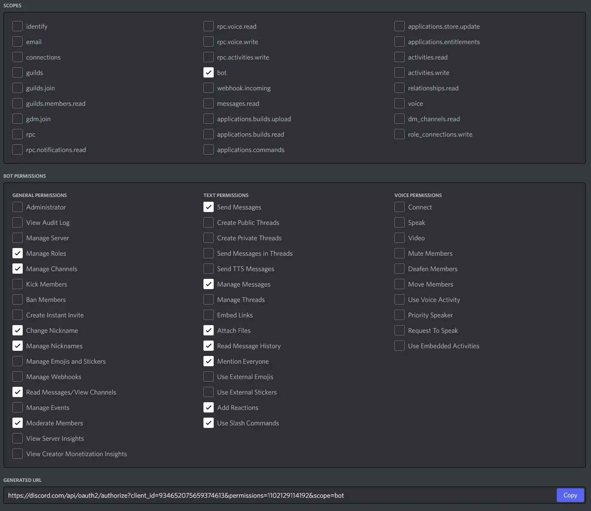

# Installation :material-download:

Discord HvZ is a Python application that *you* run yourself on nearly whatever computer you like. There are both Windows and Linux versions available, with a Mac version coming soon.  
You must complete all the steps on this page for the bot to launch without errors.

!!! info
	While setting up and managing your bot, you will have to edit configuration files. It will be more pleasant to edit these with a text editor that understands code, such as [Notepad++](https://notepad-plus-plus.org/downloads/).


## Software Installation

There are two ways to install the software itself:

!!! tip "Express Install"

	**Download a simple executable that runs from a folder.**

	This is an easy method for those who don't care about viewing or editing the source code. The caveat is that you can't use [custom script processors](../customized_chatbots/#custom-processors), which is an advanced feature that doesn't have documentation yet.


!!! warning "Advanced Install"

	**Install the Python package with all dependencies.**

	This allows one to edit any of the source code, and use [custom script processors](../customized_chatbots/#custom-processors). For those who intend to tinker with things under the hood, or even contribute to the project.

	This install is a more involved process where more things can go wrong. If using Windows, it may even require a 6GB download.


??? info "Swapping Between Install Methods"
	If you've been using the program with one install method and want to swap,
	simply move the critical files between them. **You can't transfer custom script processors to an Express Install.**  
	These are the files you should transfer, if they exist:

	- .env
	- config.yml
	- credentials.json
	- hvzdb.db
	- scripts.yml
	- token.json


### Express Install


=== ":simple-windows: Windows"

	1. Download the latest "Express Install" .zip for Windows from [Releases](https://github.com/Conner-Anderson/discord-hvz/releases){target=_blank}
	1. Unzip it to a convenient folder you intend to run the bot from.
	1. Run **Discord HvZ.exe**. The app should open, then close with an error because there are still setup steps to complete. Start with [Creating a Discord Bot](#creating-a-discord-bot)

=== ":material-linux: Linux"
	1. Download the latest "Express Install" .zip for Linux from [Releases](https://github.com/Conner-Anderson/discord-hvz/releases){target=_blank}
	1. Unzip it to a convenient folder you intend to run the bot from.
	1. Run **Discord HvZ**. The app should open, then close with an error because there are still setup steps to complete. Start with [Creating a Discord Bot](#creating-a-discord-bot)


### Advanced Install
??? warning "Advanced Install Instructions"
	=== ":simple-windows: Windows"

		These instructions assume you have already installed Python programs before.

		1. Download an "Advanced Install" .zip for Windows from [Releases](https://github.com/Conner-Anderson/discord-hvz/releases){target=_blank} **OR** download the project directly from the branch you want. Unzip it to a convenient folder you intend to run the bot from.

		1. Install any [Python](https://www.python.org/downloads/){target=_blank} version from  3.9.7 to 3.10.x. If helping with development, use 3.9.7. Open a command prompt and use `python --version` to see what you already have installed, if anything.

		1. The below steps are how to install the project's dependencies from a `pyproject.toml` file with [`Poetry`](https://python-poetry.org/docs/){target=_blank}. There are other ways to do this which you are welcome to try.

		1. Unfortunately, to compile C code that's a part of many Python modules, you need this ~6 GB software from Microsoft. Download the [Build Tools for Visual Studio Installer](https://visualstudio.microsoft.com/downloads/#build-tools-for-visual-studio-2022){target=_blank}. Launch it, select **Desktop Development**, then install the minimum items as shown: 
				
			

		1. To install `Poetry` without polluting your system with its dependencies, use the following commands in your command prompt to install pipx for your user account. The second command lets you use the [`pipx`](https://pypa.github.io/pipx/installation/){target=_blank} module directly from the command prompt.

			```
			python -m pip install --user pipx
			python -m pipx ensurepath
			```

		1. Use the following to install Poetry in its own isolated space on your system.
			```
			pipx install poetry
			pipx ensurepath
			```
		1. Direct your command prompt to your Discord HvZ folder.  
		(Pro tip: You can do this by clicking once in the address bar of File Explorer, typing `cmd` or `powershell`, then hitting Enter.)

		1. Do you want to install Discord HvZ with a Python version *other* than the one currently active? Use the command [here](https://python-poetry.org/docs/managing-environments/#switching-between-environments){target=_blank}.

		1. Install the dependencies for Discord HvZ in a virtual environement for this specific folder:
			```
			poetry install
			```
		If you're assisting with development, use this instead:
			```
			poetry install --with dev
			```

		1. If there's no `.env` file in the top directory, copy it from the `default_data_files` folder to the top directory of the project. You'll need it in the next section. You may need to show hidden files to do this.

		1. Run the bot:
			```
			poetry run main
			```
		The bot should run, then close with an error because there are still setup steps to complete. Keep reading below!


	=== ":material-linux: Linux"
		These instructions assume you have already installed Python programs before and are familiar with Linux.  
		(I am not very familiar with Linux.)

		1. Download an "Advanced Install" .zip for Linux from [Releases](https://github.com/Conner-Anderson/discord-hvz/releases){target=_blank} **OR** download the project directly from the branch you want. Unzip it to a convenient folder you intend to run the bot from.

		1. Linux usually comes with Python installed. Open a command prompt and use `python --version` to see what you already have installed. You may use any [Python](https://www.python.org/downloads/){target=_blank} version from  3.9.7 to 3.10.x. If helping with development, use 3.9.7. 

		1. The below steps are how to install the project's dependencies from a `pyproject.toml` file with [`Poetry`](https://python-poetry.org/docs/){target=_blank}. There are other ways to do this which you are welcome to try.

		1. To install `Poetry` without polluting your system with its dependencies, use the following commands in your command prompt to install [`pipx`](https://pypa.github.io/pipx/). The second command lets you use the [`pipx`](https://pypa.github.io/pipx/installation/){target=_blank} module directly from the command prompt.

			```
			sudo apt update
			sudo apt install pipx
			```

		1. Use the following to install Poetry in its own isolated space on your system.
			```
			pipx install poetry
			pipx ensurepath
			```
		1. Open a command prompt in your Discord HvZ folder.  

		1. Do you want to install Discord HvZ with a Python version *other* than the one currently active? Use the command [here](https://python-poetry.org/docs/managing-environments/#switching-between-environments){target=_blank}.

		1. Install the dependencies for Discord HvZ in a virtual environement for this specific folder:
			```
			poetry install
			```
		If you're assisting with development, use this instead:
			```
			poetry install --with dev
			```

		1. Copy the `.env` file from the `default_data_files` folder to the top directory of the project. You'll need it in the next section. You may need to show hidden files to do this.

		1. Run the bot, with your command prompt directed to the project folder:
			```
			poetry run main
			```
		The bot should run, then close with an error because there are still setup steps to complete. Keep reading below!


## Creating a Discord Bot

### Setting Up a Bot Account

1. Go to the [Discord Developer Portal](https://discord.com/developers/applications){target=_blank} and login with your account.
1. Go to the **Applications** page and create a new application. The name you select here *is not* the name of the bot. This "application" is more like a set of credentials that the bot will use.
1. Go to the **Bot** tab of your new Application and click **Add Bot**. Give it the username it will have on your server. Make sure the **Public Bot** switch is *off*. This bot should be private.
1. Turn on all **Privileged Gateway Intents**. 
1. Use the **Copy** button on this page to copy the bot token to your clipboard. This is a secret code that lets your bot identify itself to Discord. If someone else gets this token, they can impersonate your bot: never share it.
1. Go to your installation of Discord HvZ and open the `.env` file in a text editor. Your OS may hide files that start with a `.`, so you may need to show hidden items through the **View** menu of your file browser.
1. Paste your token between the quotes and save the file. The file should then look something like this: `TOKEN='123ABC789a456g6_ad45.816d_d454wd'` Your bot now has permission to use the account Discord gives it.

### Inviting the Bot

1. Make sure you have the administrator access on the Discord server you want to run the bot on. You need to be able to invite the bot and manage its permissions.
1. Go back to the application you created on the [Discord Developer Portal](https://discord.com/developers/applications){target=_blank} and to the **URL Generator** page in the **OAuth2** section.
1. Check boxes until the permissions look like the picture below. These are the permissions your server needs to grant the bot to do its job.

1. Copy the **Generated URL** and use your browser to follow it. Follow the instructions to invite your bot to the correct server.
1. Go back to your application at the Developer Portal and to its General Information page. Copy the **Application ID** to your clipboard.
1. Open the `config.yml` file in your installation of Discord HvZ and paste it over an existing ID labeled `live`. Now your bot knows which server it should interact with.


## Setting up Google Sheets

The nicest way the bot displays the player and tag lists is through a Google Sheets document. Anyone who knows how to use a spreadsheet can read and manipulate the information. Unfortunately, Google makes their interface to set this up a bit awkward. Feel free to come back to this step later by disabling the Sheets feature by setting the [google_sheets_export](../config_options/#google_sheet_export) option in `config.yml` to false.

The interfaces on the following Google pages are big and complicated. Take your time and look carefully.

1. Go [here](https://console.cloud.google.com/projectcreate){target=_blank} to make a Google Cloud Platform project. The **Location** field is not important.
1. Use the navigation menu :material-menu: in the top left and go to **APIs & Services** then **Library**. Search for "Google Sheets" and **Enable** the Google Sheets API.
1. Go back to **APIs & Services**, but this time to the **OAuth consent screen** page. Follow the instructions there to set up a consent screen, only filling in the required information and skipping everything else.
1. Go to the **Credentials** tab of the **APIs & Services** section and use the **Create Credentials** button to make an **OAuth client ID**. Again, the information you put in here isn't critical.
1. When done, you'll get the option to **DOWNLOAD JSON**. Look around for a :material-download: icon and download the file to your installation of Discord HvZ.
1. Rename this `.json` file to `credentials.JSON`. Now your bot has permission to communicate with Google!
1. Go to [Google Drive](https://drive.google.com/) and create a Sheets document which will be used to display members and tags to your admin or moderator team during the game. Set up its location and permissions appropriately for that purpose.
1. Add two sheets to this document: one called "Members" and the other called "Tags". If you want to change these names, see the [sheet_names](../config_options/#sheet_names) config option.
1. Copy the sheet ID from the URL in your address bar. It is the code highlighted here: 
1. In `config.yml`, find the `sheet_ids` section section and paste the ID over the one labeled `live`. Now your bot knows what sheet to send data to.
1. The first time you launch the bot, it will open a browser window and ask you to log in with a Google Account. The only requirements for this account are that it has edit access to the bot's Google Sheet: it could be a personal account, or one created only for this purpose.

!!! bug
		The Google login for Sheets will expire after a few days, even when running. That isn't supposed to happen unless the bot is offline for days.  
		In the meantime, reboot the bot daily to stay logged in.


## Final Steps

Configure the `channel_names` section in `config.yml`. Please see [Config Options: channel_names](../config_options/#channel_names) for information. You can change these channels later, but **the bot must have permission to view and post in these channels.**

Configure the `roles` section configured as well. See [Config Options: role_names](../config_options/#role_names) for information.
**The bot must have permission to manage these roles**, meaning they have to be lower than it in the role hierarchy in the server settings. 

### Start the Bot

Now the time has come to start the bot for real. After you do, check if it spits out any alarming errors. If so, scroll up and check that you did everything.

There's still more to do before starting a game of HvZ, so continue to [Server Setup](../server_setup).