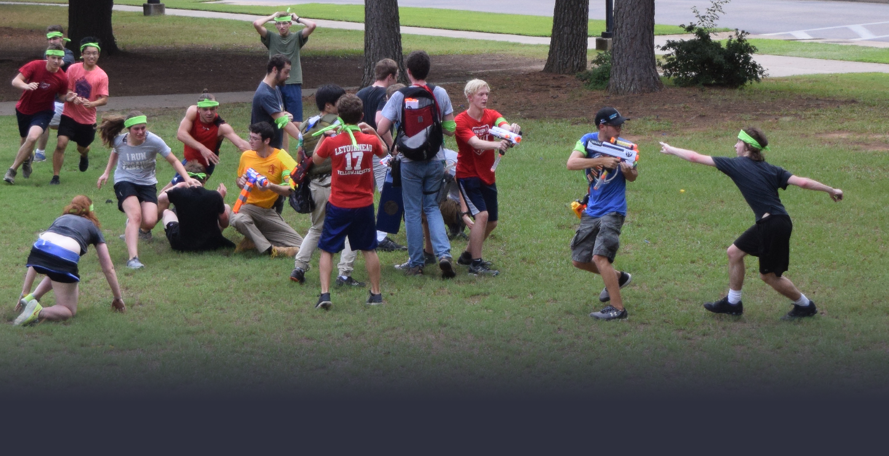

# Running the Game

## Core Concepts

### Permissions and Roles

When at all possible, this bot is designed to use Discord permissions and roles to manage the game.

When you remove a player's *human* role and give them a *zombie* role, they **are** a zombie. The bot will follow along behind the scenes just fine.

### Chatbots

A chatbot is a conversation the bot holds with a member through private messages to collect information. By default, the bot comes with two: registration, and tag_logging. Chatbots are launched when the member clicks a button created by the [post_button](../commands/#post_button) command, or when an admin uses the [tag create](../commands/#tag-create) / [member register](../commands/#member-register) commands.

Set up the bot and try one out!

### OZs

An OZ is an Original Zombie: a zombie who is set up by the admins. Every game must begin with one or more OZs. As far as this bot is concerned, an OZ is a player who can click the [tag_logging button](../commands/#post_button) even if they are human. There is an [OZ command](../commands/#oz) which is recommended, but that is merely an aid for convenience and to make later statistics easier.

### Items

In a game of HvZ, admins often give out special items to players. Zombies get pool noodles to tag from a distance, humans get armor for an extra life, etc. Sometimes you want to track who has what item. The items system is a simple way to connect items to players on the Discord server. 

Items are just names you make up and assign to a player, which you can then transfer around between players or take away. A gloried notepad really. Players never see these items: it is purely a system for admin tracking.

Everything to do with the item system can be found here: [Commands: Items](../commands/#item-commands)

## Chronology of a Game

### Registration

To register Discord server members for the game, simply allow them to click a [registration button](../commands/#post_button). Registered users are then entered into the database, assigned generated tag codes, and ready to play.

Players need to be given their tag codes before they can be tagged. At LeTourneau University, players were given green bandanas with their tag codes written in marker by the admins. In this case, the admins would just refer to the Google Sheet for these codes.

Another option is to let players keep their own tag codes, such as on a piece of paper. They can retrieve them with the [code](../commands/#code) command.

### Set up OZs

In the default registration chatbot script, there is a field for players to request or deny being an OZ. If you keep this field, it's a great way to narrow the pool of players to select from.

Regardless of how you select the OZs, the game begins when they make their first tag. Using the [OZ command](../commands/#oz) is a nice way to allow them into the appropriate channel without revealing their identity to the server. 

You should consider using the [silent_oz](../config_options/#silent_oz) config option at this point.

Once the OZs are publically revealed, it is a good idea to give them the zombie role and remove their human role, since there's no pretense of secrecy anymore.

### Manage the Game

After zombies are loose, the bot mostly handles everything, leaving you to deal with problems out in the real world. Zombies will use the tag logging chatbot to turn humans into zombies, the tags get announced in the appropriate channel, and the zombie channel starts getting more active. You should probably post with the [tag tree](../commands/#tag-tree) command every so often to show players the dangerous zombies.

There typically comes a point in the game where you will accept no new players. Use the [registration](../config_options/#registration) config option to disallow new players, or make the registration channel inaccessible.

When players use the bot wrong, or have disputes, or have some edge-case that I haven't thought of because they're human, use the various [commands](../commands) to manage it all. If you really get stuck, email the developer for help (**conneranderson.dev@gmail.com**) or submit an issue on the [github](https://github.com/Conner-Anderson/discord-hvz/issues).

### Conclude the Game

Once the final mission comes or whatever you decide should stop zombie tagging, simply [tag_logging](../config_options/#tag_logging) config option to stop tagging, or restrict the tag logging channel.

That's it! Make sure to save the contents of the Google Sheet somewhere safe for reference. If you're going to use the server for other things when not playing HvZ, you can remove roles until all the unneeded channels become invisible, then put those channels into a category to keep until next time.

