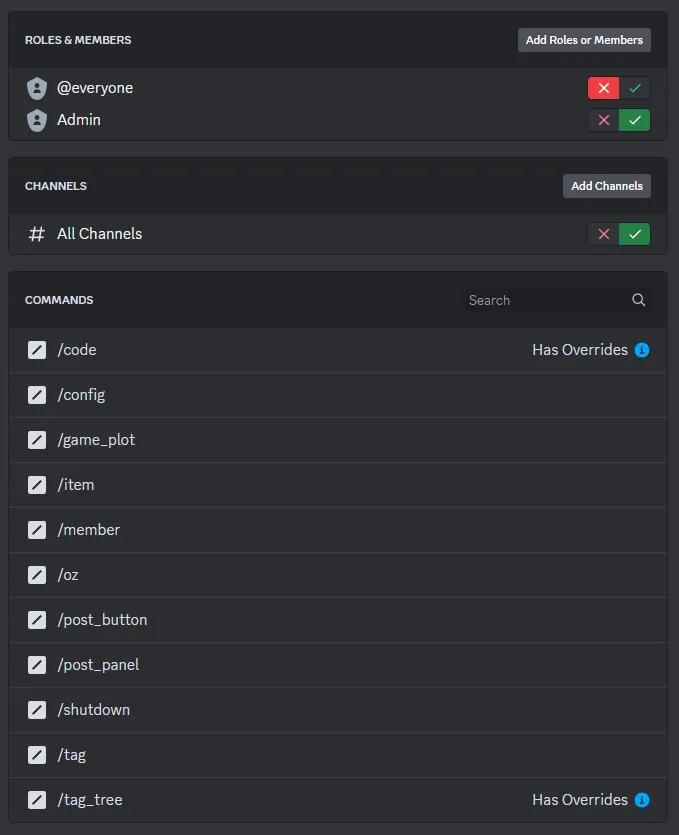

# Server Setup

!!! info "Prerequisite"
        **These steps depend on a working bot after successful [installation](installation.md).**

This bot is managed with Slash Commands. If you're unfamiliar with Discord Slash Commands, look here: [Slash Commands Overview](commands.md#overview)  
Remember, you can't use a command in a channel the bot can't read and send messages in.

### Buttons

To play the game, server members need a way to click the registration button, and zombies need a way to click the tag logging button. Let's create those now. 

Go the channel you want the registration button in. It is recommended that this channel be one dedicated to information about the game. 
Send the command [`/post_button`](commands.md#post_button) and selection "registration" as the `button_1` option. 

!!! info

    If you don't like where the registration button sits in the channel, you can always delete it and try again later. The buttons are quite forgiving.

Do the same for the `tag_logging` button in the same channel you configured as the [`report-tags`](config_options.md#report-tags) channel. You can get creative and post this button in other places too, but be warned: **anyone who can click the button can try to log a tag, even humans.** It is designed this way so *you* are responsible for setting up the server roles, permissions, and channels to keep humans and zombies where you want them.

Remember that during tag logging and registration, threads will be created for the users to interact with the bot. Make sure the channel you post the buttons in has permission to create threads.

It is also recommended that you create a channel purely for sending the bot commands, and leave it muted. No need to clutter up other channels with that. Remember to give the bot access to it.

### Commands

Discord lets you manage command permissions through `Server Settings / Integrations / [Your Bot]`. Here you can give permissions to certain members and roles to use categories of commands. **By default, everyone can use everything.** That's bad, so restrict most commands to only your admins. The `/code` command is designed to be used by players though.

??? example "Recommended Starting Permissions"
    This is a good default permission setup to begin with. Disable commands for the `@everyone` role, and enable them for your administration role. Enable the bot in all channels.
    Override the permissions for the `/code` command to allow all players to use it (the same role as set in [`role_names`](config_options.md#role_names))  
    Override the permissions for `/tag_tree` so your moderator team can use it.
      
    You can restrict the bot to only certain channels, but remember that the bot must have permission to view and post in the channels [listed here](config_options.md#channel_names).
Currently, commands are sorted into groups: `member`, `tag`, etc. Discord doesn't let you vary permissions between commands within a group. This way of organizing commands may change, especially if people complain about it.

!!! question "Next Steps"
        At this point in the setup process, it is probably a good idea to read the [Running the Game](running_the_game.md) guide and do a test game with some of your team. Register some users, set some OZs, and start tagging! This'll help you really understand how the system works and what you'd like to tweak.  
        When you're ready, take a look at [Customized Chatbots](customized_chatbots.md) to put on the final touches!

### Next Steps

At this point in the setup process, it is probably a good idea to read the [Running the Game](running_the_game.md) guide and do a test game with some of your team. Register some users, set some OZs, and start tagging! This'll help you really understand how the system works and what you'd like to tweak.  
After testing, you'll probably want to modify the registration and tag logging chatbots to use questions relevent to your game.
Go to the [Customized Chatbots](customized_chatbots.md) page to learn about configuring these questions.
